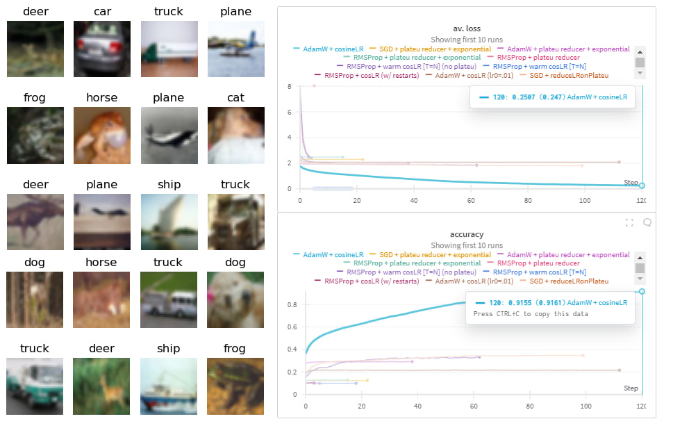

# wbtech_cv

This repository showcases my learning journey into the world of CV at the WBTech (largest retailer in Russia: https://www.wildberries.ru/). Here you can find all the work that been done during this internship:
* `vit_customVSfinetuned.ipynb`: comparative analysis of a custom ViT implementation vs a finetuned one on the CIFAR10 dataset (stack: wandb,pytorch,torchvision,transformers,peft,h5py,plotly)
    
